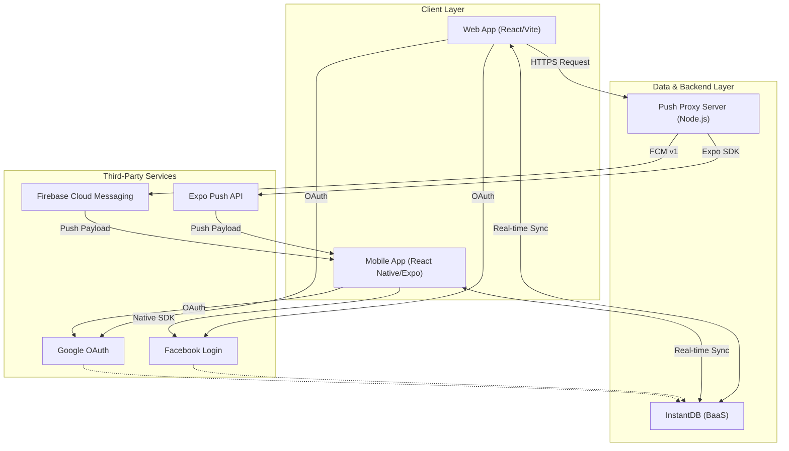
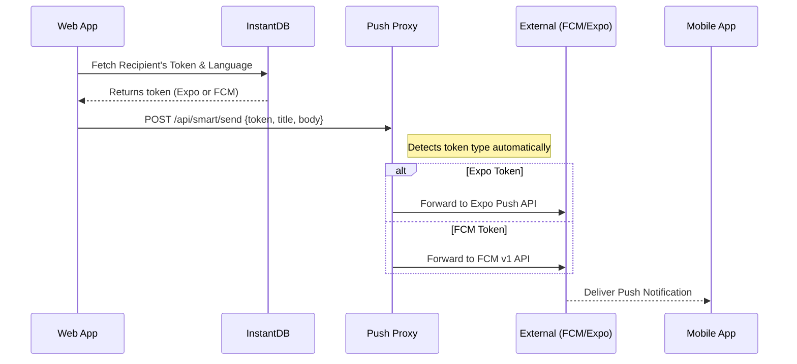

# DOTO - Location-Based Help App

DOTO is a multi-platform application designed to connect people who need help with "angels" in their vicinity who can provide assistance. It features a real-time mobile application built with React Native and Expo, and a web-based administration and tracking interface.

## Architecture

The project follows a modern serverless-first architecture using InstantDB for real-time data synchronization and authentication.

### System Overview

### Push Notification Flow

## Key Technologies

- **Mobile**: React Native, Expo, React Navigation, Zustand
- **Web**: React, Vite, Tailwind CSS, Zustand
- **Backend/Database**: InstantDB (Real-time BaaS)
- **Push Notifications**: Node.js Proxy (Express, Firebase Admin SDK)
- **Authentication**: Google OAuth, Native Facebook SDK

## Getting Started

### Mobile App
- Root directory contains the Expo project.
- Run `npm install` and then `npx expo start`.
- Refer to [docs/README.md](docs/README.md) for more mobile-specific details.

### Web App
- Located in the `webapp/` directory.
- Run `cd webapp && npm install` and then `npm run dev`.
- Refer to [webapp/PUSH_PROXY_README.md](webapp/PUSH_PROXY_README.md) for push notification setup.

## Project Structure

- `src/`: Core logic for the mobile application.
- `webapp/`: Source code for the web client and push proxy server.
- `android/`: Native Android project files.
- `docs/`: Additional project documentation.
